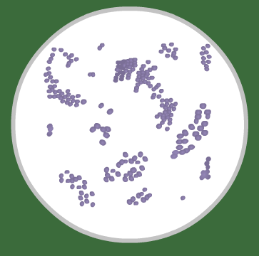
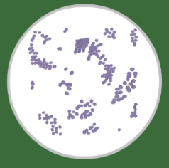
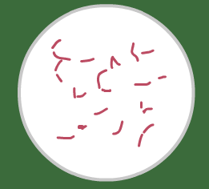
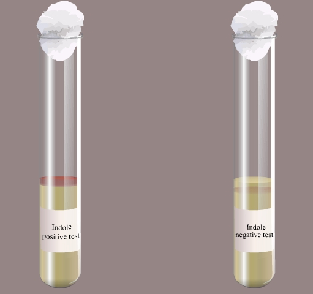
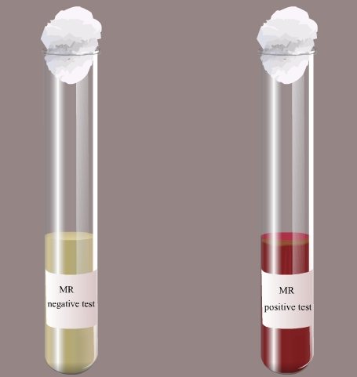
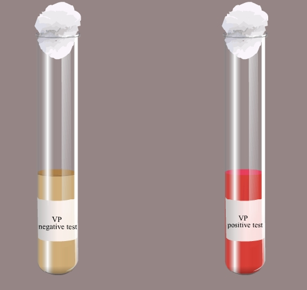
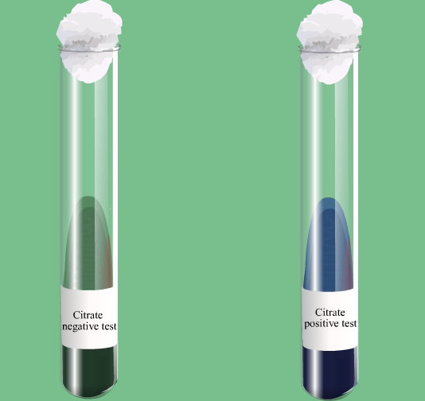
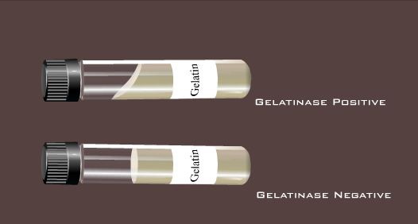
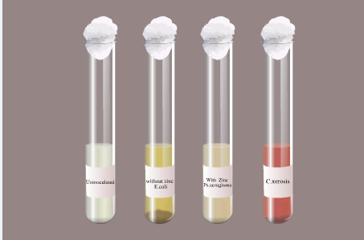
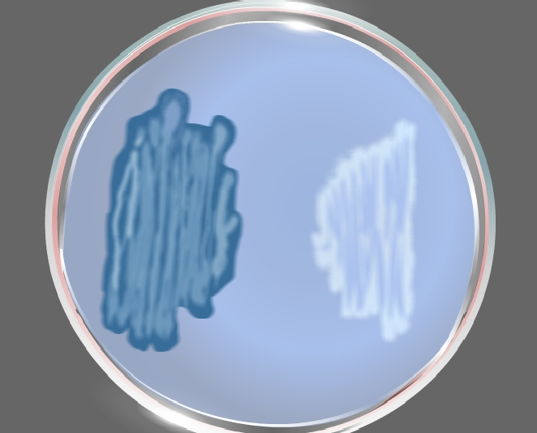

### Principle:
 

The identification of bacteria is a careful and systematic process that uses many different techniques to narrow down the types of bacteria that are present in an unknown bacterial culture. It produces  benefits  for  many  aspects  of  the  research  of microorganisms and helps physicians correctly  treat patients.   Multiple  tests were performed  to provide  the  fermentation  abilities,  presence  of  certain  enzymes,  and  certain  biochemical reactions.  Qualitative observations were made on the tests, which were compared to unknown bacteria  identification  key  to  aid with  the  identification  process.

&nbsp;

Various steps involved in the identification of unknown bacteria are:

&nbsp;

### Isolation:
 
The importance of this step is to isolate pure colonies of bacteria. The streak plate is a qualitative isolation method; quadrant streaking is mostly done to obtain pure colonies. The inoculation of the culture is made on the agar surface by back and forth streaking with the inoculation loop over the solid agar surface. This will make a dilution gradient across the agar plate. Upon incubation, individual colonies will arise from the biomass.

&nbsp;

The characteristics features of the colonies on solid agar media are then noted. This include

. Shape : circular, irregular or rhizoid.

. Size: small, medium, large( or in millimetres).

. Elevation: elevated, convex, concave, umbonate/umbilicate.

. Surface: Smooth, wavy, rough, granular, papillate or glistening.

. Edges: entire, undulate, crenated, fimbriate or curled.

. Colour: Yelow, green etc.( Note the colour of the colony).

. Structure: opaque, translucent or transparent.

. Degree of growth : scanty, moderate or profuse.

. Nature: discrete or confluent, filiform, spreading or rhizoid.
 
&nbsp;

In order to obtain the pure culture of organism, the isolated colonies are aseptically transferred on to different nutrient agar slant tubes and incubated overnight at 37 degree Celsius. It is then stored for future purpose.

&nbsp;

### Staining Reactions:
 
Staining is a simple basic technique that is used to identify microorganisms. Simple staining is used to study the morphology of all microorganisms (Fig 1). The simple stain uses the basic dyes such as Methylene blue or basic fuschin. The strong negative charge of the bacterial cell will strongly bind with the positive charged basic dyes and will impart its colour to all bacteria.

&nbsp;

&nbsp;

**Fig 1: Simple staining of cocci**
 
Gram staining is a differential staining technique that imparts different colours to different bacteria or bacterial structures. Usually it differentiates bacteria into two groups; gram positive and gram negative. The primary stain Crystal violet and mordent Iodine form a strong CVI complex all bacteria. Gram positive cells due to their thick peptidoglycan layer will retain the CVI complex even after it is subjected to decolourization with acetone or alcohol. Hence the counter stain Safranin has no action on gram positive cells. But in the case of gram negative, the thin peptidoglycan layer and more lipid contents in the cell wall will easily make them susceptible to the action of decolorizer and hence CVI complex is easily washed out and hence the gram negative cells will the colour of counter stain Safranin.  Hence after the gram staining, the gram positive cells appear as purple and gram negative cells appear as pink (Fig 2). The study of morphological features  and staining characteristics help in the preliminary identification of the isolate.

<b>Gram positive bacteria | <b> Gram negative bacteria
:--|:--|
<b>  |  

 &nbsp;

**Fig 2: Bacteria identification from stains**
 
  
 &nbsp;
 
 ### Biochemical reactions:
 

Gram negative enteric bacilli play an important role in the contamination of food. Hence they are the main causative agents of intestinal infection. Gram negative family includes Shigella, Salmonella, Proteus, Klebsiella,Escherichia,Enterobacter etc. Usually four tests are used for differentiation of the various members of Enterobactericeae. They are Indole test,Methyl red test, Voges proskauer test and Citrate test; collectively known as IMViC series of reactions.

  
 &nbsp;

### Indole test:

 

Indole tests looks for the presence or absence of tryptophanase enzyme production of the bacteria. If the enzyme is present, it will degrade the aminoacid tryptophan in the media and will produce Indole, ammonia and pyruvic acid. Indole will react with Kovac's reagent to produce a cherry red complex, which indicates a positive indole test. The absence of red color is indicative of tryptophan hydrolysis due to the lack of tryptophanse enzyme(Fig 3).

&nbsp;
 

&nbsp;
 
**Fig 3:  Indole test**
  
  
 &nbsp;
 
 ### Methyl Red Test:
 

This test detects the ability of microorganism to ferment glucose and to produce acidic end products. Enteric organism produces pyruvic acid from glucose metabolism. Some enteric will then use the mixed acid pathway to metabolize pyruvic acid to other acidic products such as lactic acid, acetic acid and formic acids. This will reduce the pH of the media. Methyl red is a pH indicator which is red at the acidic pH (below 4.4) and yellow at alkaline pH (above 7). The formation of red color after the addition of Methyl red reagent indicates the accumulation of acidic end products in the medium and is an indicative of positive test (Fig 4).

&nbsp;
             

&nbsp;
 
**Fig 4:  Methyl red test**

&nbsp;

### Voges Proskauer Test:
 

This test determines the ability of microorganism to ferment glucose. The end products of glucose metabolism,pyruvic acid, is further metabolized by using Butylene glucol pathway to produce neutral end such as acetoin and 2,3 butanediol. When Barrit's reagent A ( 40% KOH) and Barrit's reagent B (5% solution of alpha naphthol) is added it will detect the presence of acetoin, the precursor in the 2,3- butanediol synthesis. Acetoin in the presence of Oxygen and Barrit's reagent is oxidized to diacetyl, where alpha naphthol act as a catalyst. Diacetyl then reacts with guanidine components of peptone to produce a cherry red colour (Fig 5).

                                                                                                             

&nbsp;

&nbsp;
 
**Fig 5:  Voges prausker test**
 
&nbsp;

### Citrate Utilization Test:
 

This test determines the ability of microorganism to utilize Citrate. Some bacteria have the capability to convert the salts of organic acids, for example, Sodium citrate to alkaline carbonates. Sodium citrate is one of the important metabolite of Kreb's cycle. Certain bacteria use citrate as the sole carbon source. Citrate utilization requires a specific membrane transporter and citrate lyase activity. Citrate is converted to Oxalo acetic acid by citrate lyase and oxaloacetate decarboxylase activity will convert oxaloacetate to pyruvate with the release of carbondioxide. The other products of the reaction are acetate, Lactic acid, formic acid etc. The carbondioxide reacts with sodium and water to form sodium carbonate (Fig 6).

&nbsp;

&nbsp;

**Fig 6:   Citrate test**

&nbsp;

### TSI:
 

The triple sugar- iron agar test is designed to differentiate among the different groups or genera of the Enterobacteriaceae, which are all gram negative bacilli capable of fermenting glucose with the production of acid, and to distinguish them from other gram negative intestinal bacilli. This differentiation is based on the differences in carbohydrate fermentation patterns and hydrogen sulfide production by the various groups of intestinal organisms. Carbohydrate fermentation is detected by the presence of gas and a visible colour change (from red to yellow) of the pH indicator, phenol red. The production of hydrogen sulfide is indicated by the presence of a precipitate that blackens the medium in the butt of the tube. TSI Agar contains three fermentative sugars, lactose and sucrose in 1% concentrations and glucose in a concentration of 0.1%. Due to the building of acid during fermentation, the pH falls. The acid base indicator Phenol red is incorporated for detecting carbohydrate fermentation that is indicated by the change in colour of the medium from orange red to yellow in the presence of acids. In case of oxidative decarboxylation of peptone, alkaline products are built and the pH rises. This is indicated by the change in colour of the medium from orange red to deep red. Sodium thiosulfate and ferrous ammonium sulfate present in the medium detects the production of hydrogen sulfide (indicated by blackening in the butt of the tube). To facilitate the detection of organisms that only ferment glucose, the glucose concentration is one-tenth the concentration of lactose or sucrose. The small amount of acid produced in the slant of the tube during glucose fermentation oxidizes rapidly, causing the medium to remain orange red or revert to an alkaline pH. In contrast, the acid reaction (yellow) is maintained in the butt of the tube since it is under lower oxygen tension. After depletion of the limited glucose, organisms able to do so will begin to utilize the lactose or sucrose. To enhance the alkaline condition of the slant, free exchange of air must be permitted by closing the tube cap loosely. If the tube is tightly closed, an acid reaction (caused solely by glucose fermentation) will also involve the slant.

 
&nbsp;

### Urease test:
 

Urea is a nitrogen containing compound that is produced during the decarboxylation process of the amino acid arginine in the urea cycle. Urea is highly soluble in water and is thus it is an efficient way for the human body to excess nitrogen. This excess urea is then taken away from the body with the help of the kidneys as a part of urine. Certain bacteria produce the enzyme urease during its metabolism process and that will break down the urea in the medium to ammonia and carbon dioxide:

 &nbsp;
 

Some enteric bacteria produce the enzyme urease, which splits the urea molecule into carbon dioxide and ammonia. The urease test is useful in identifying the genera Proteus, Providentia, and Morganella, which liberate this enzyme.

                                                       

 &nbsp;
 

Urease, which is produced by some micro organisms, is an enzyme that is especially helpful in the identification of Proteus vulgaris, although other organisms may produce urease, their action on the substrate urea tends to be slower than that seen with Proteus species. Therefore this test serves to rapidly distinguish members of this genus from other lactose non fermenting enteric micro organisms.

 

Urease is a hydrolytic enzyme that attacks the nitrogen and carbon bond in amide compounds such as urea and forms the alkaline end product ammonia. The presence of urease is detectable when the organisms are grown in a urea broth medium containing the pH indicator phenol red. As the substrate urea is split into its products, the presence of ammonia creates an alkaline environment that causes the phenol red to turn to deep pink. This is a positive reaction for the presence of urease. Failure of deep pink colour to develop is evidence of a negative reaction.

 
&nbsp;

### SIM:
 

The ability of an organism to move by itself is called motility. Motility is closely linked with chemotaxis, the ability to orientate along certain chemical gradients. Eucaryotic cells can move by means of different  locomotor organelles such as cilia, flagella, or pseudopods. Prokaryotes move by means of propeller-like flagella unique to bacteria or by special fibrils that produce a gliding form of motility. Almost all spiral bacteria and about half of the bacilli are motile, whereas essentially none of the cocci are motile.

 
&nbsp;

The medium mainly used for this purpose is  SIM medium ( Sulphide Indole Motility medium) which is a combination differential medium that tests three different parameters, sulphur reduction, indole production and motility. This media has a very soft consistency that allows motile bacteria to migrate readily through them causing cloudiness. In soft agar tubes non-motile bacteria will only grow on the inoculated region. Motile bacteria will grow along the stab line and will tend to swim out away from the stabbed area. Therefore, a negative result is represented by growth in a distinct zone directly along the stab. A positive result is indicated by diffuse or cloudy growth mainly at the top and bottom of the stabbed region.
 

 

SIM agar may also be used to detect the presence of  H2S production. The SIM medium contains peptones and sodium thiosulfate  as  substrates,  and  ferrous  ammonium  sulfate, Fe(NH4)SO4,  as  the H2S  indicator. Cysteine  is  a component of the peptones used in SIM medium. Sufficient agar  is present  to make  the medium semisolid. Once H2S  is produced,  it  combines with  the  ferrous ammonium sulfate, forming an insoluble, black ferrous sulfide precipitate that can be seen along the line of the stab inoculation. If the organism is also motile, the entire  tube may  turn black. This black line or tube indicates a positive H2S  reaction; absence of a black precipitate indicates a negative reaction.
 
&nbsp;

 

### Gelatin Hydrolysis Test:
 

Gelatin, a protein derived from the animal protein collagen. It has been used as a solidifying agent in food for a long time. Robert Koch used nutrient gelatin as an early type of solid growth medium. One problem is that many bacteria have the ability to hydrolyze (liquefy) gelatin. This gelatin liquefaction ability (or inability) forms the basis for this test. Some microorganisms possess an enzyme called gelatinase, which breaks down gelatin into amino acids. Gelatin deeps contain the substrate gelatin, which is a protein produced by the hydrolysis of collagen. Organisms which hydrolyze gelatin will cause the gelatin to liquefy.

 

The gelatin hydrolysis tests for an organism's ability to break down the protein gelatin which is derived from collagen.  Gelatin causes the media to thicken, especially at cooler (below 28oC)  temperatures.  If the organism can release gelatinase enzymes the gelatin is broken down or liquefied.  The media is checked over a period of about a week after inoculation and incubation at room temperature, for gelatinase activity.  The tube is placed on ice for a few minutes and if the media fails to solidify it is considered a positive test.   The gelatinase reaction may be slow or incomplete (Fig 7).

&nbsp;

&nbsp;
 
**Fig 7: Gelatin hydrolysis test (The gelatin hydrolysis is indicated by the liquid nature of the gelatin ( positive test) and the negative test is indicated by the solid nature of the gelatin)**

&nbsp;
 

### Nitrate Reduction Broth:
 

Bacterial species may be classified into different groups depends on  their ability to reduce nitrate to nitrite or nitrogenous gases provided in the growth medium. The reduction in nitrate can be coupled  to anaerobic respiration in some bacterial species.  Nitrate, present in the broth, is reduced to nitrite which  is  then reduced to nitric oxide, nitrous oxide, or nitrogen. The basis of nitrate reduction test the detection of nitrite and its ability to form a red colored  compound when it reacts with reagent A which is  sulfanilic acid  and to form a complex (nitrite-sulfanilic acid) which then reacts with Reagent B which is α-naphthylamine to give a red precipitate (prontosil). Zinc powder act as a catalyst and that will favours the reduction of nitrate to nitrite. Nitrate reaction occurs only under anaerobic conditions (Fig 8). The medium is then transferred in tubes to make a low surface area to depth ratio that will limit the diffusion of oxygen into the growth medium. Most bacteria utilize the available oxygen in the medium for their growth and will rapidly produce anaerobic conditions for the further reactions.

&nbsp;

                   

&nbsp;
   
**Fig 8:    Nitrate reduction test**

&nbsp;

### Catalase Test:
 

The inability of strict anaerobes to synthesize catalase, peroxidase, or superoxide dismutase may explain why oxygen is poisonous to these microorganisms. In the absence of these enzymes, the toxic concentration of H2O2 cannot be degraded when these organisms are cultivated in the presence of oxygen. Organisms capable of producing catalase rapidly degrade hydrogen peroxide which is a tetramer  containing four polypeptide chains, which are usually  500 amino acids long. It also contains four porphyrin heme groups(ie., iron groups) that will allow the enzyme to react with the hydrogen peroxide.

The enzyme catalase is present in most cytochrome containing aerobic and facultative anaerobic bacteria. Catalase has one of the highest turnover numbers of all enzymes such that one molecule of catalase can convert millions of molecules of hydrogen peroxide to water and oxygen in a second.

Catalase production and activity can be detected by adding the substrate H2O2 to an appropriately incubated (18- to 24-hour) tryptic soy agar slant culture. Organisms which produce the enzyme break down the hydrogen peroxide, and the resulting O2 production produces bubbles in the reagent drop, indicating a positive test. Organisms lacking the cytochrome system also lack the catalase enzyme and are unable to break down hydrogen peroxide, into O2 and water and are catalase negative.

 

&nbsp;
 

 

### Coagulase Test:
 

Coagulases are enzymes that clot blood plasma by a mechanism that is similar to normal clotting. The coagulase test identifies whether an organism produces this exoenzyme. This enzyme clots the plasma component of blood. The only significant disease-causing bacteria of humans that produce coagulase are Staphylococcus aureus. Thus this enzyme is a good indicator of the pathogenic potential of S. aureus. In the test, the sample is added to rabbit plasma and held at 37° C for a specified period of time. Formation of clot within 4 hours is indicated as a positive result and indicative of a virulent Staphylococcus aureus strain. The absence of coagulation after 24 hours of incubation is a negative result, indicative of an avirulent strain.

&nbsp;
  

### Oxidase Test:

Oxidase test is an important differential procedure that should be performed on all gram-negative bacteria for their rapid identification. The test depends on the ability of certain bacteria to produce indophenol blue from the oxidation of dimethyl-p-phenylenediamine and α-naphthol. This method uses N,N-dimethyl-p-phenylenediamine oxalate in which all Staphylococci were oxidase negative. In presence of the enzyme cytochrome oxidase (gram-negative bacteria) the N,N-dimethyl-p-phenylenediamine oxalate and α-naphthol react to indophenol blue. Pseudomonas aeruginosa is an oxidase positive organism.

&nbsp;
 

### Starch Hydrolysis Test:

Amylases are a class of enzymes that are capable of digesting these glycosidic linkages found in starches. Amylases can be derived from a variety of sources. Amylases are present in all living organisms, but the enzymes vary in activity, specificity and requirements from species to species and even from tissue to tissue in the same organism. Alpha-amylase (1,4 alpha D-Glucan-glucanohydrolase) acts upon large polymers of starch at internal bonds and cleaves them to short glucose polymers. Alpha-amylase catalyzes the hydrolysis of internal Alpha-1-4 glucan bonds in polysaccharides containing 3 or more alpha 1-4 linkages; it results in a mixture of maltose and glucose. Amyloglucosidase works on the shorter polymers and splits off single glucose sugars. Bacterial alpha-amylase is particularly suited for industrial usage since it is inexpensive and isothermally stable.

Starch agar is an example of differential medium which tests the ability of an organism to produce certain alpha-amylase and oligo-1, 6-glucosidase that hydrolyze starch. Starch molecules are too large to enter into the bacterial cells, so some bacteria will secrete exoenzymes that will degrade starch into subunits that can be then easily utilized by the organism.

Starch agar is a simple nutritive medium with starch added.  Since no colour change occurs in the medium when organisms hydrolyze starch, iodine solution is added  to the plate after incubation. Iodine turns blue, purple, or black (the colour depends on the concentration of the iodine used) in the presence of starch. A clearing around the bacterial growth shows that the organism has hydrolyzed starch.

 

&nbsp;
 
 

### Lipid Hydrolysis:
 

Trybutyrene agar is used for the detection and enumeration of lipolytic microorganisms in food and other material (Fig 9).

&nbsp;
  

  

&nbsp;
 

**Fig 9:  Lipid hydrolysis: Left side;positive for lipid hydrolysis;right side;negative for lipid hydrolysis**

&nbsp;
  

### Growth on selective and differential media:
 

Selective media allows only the growth of certain types of organisms, while inhibiting the growth of other organisms.

Eg: Mannitol salt agar, Hektoen enteric agar (HE), Phenylethyl alcohol agar.

Differential media are employed to differentiate certain closely related organisms or groups of organisms. Depending on the presence of specific dyes or chemicals in the growth media, the organisms will tend to produce certain specific characteristic changes or growth patterns that can be used for further identification or differentiation steps.
 

Eg: MacConkey (MCK)agar, Eosin Methylene Blue (EMB) agar .

 

Enriched media are media that have been supplemented with highly nutritious materials such as blood, serum or yeast extract for the purpose of cultivating fastidious organisms.

Eg: Blood agar, Chocolate agar
 

 

Mannitol salt agar is both a selective and differential media used for the isolation of pathogenic Staphylococci from mixed cultures.

Eosin methylene blue agar is both a selective and differential medium used for the detecting and isolating Gram-negative pathogens residing in the intestine.

 
MacConkey’s Agar is both a selective & differential media that is selective for Gram negative bacteria and can differentiate those bacteria that are able to ferment lactose.

 

Different streptococci produce different effects on the red blood cells in blood agar. Those that produce incomplete hemolysis and only partial destruction of the cells around colonies are called alpha-hemolytic Streptococci. Characteristically, this type of hemolysis is seen as a distinct greening of the agar in the hemolytic zone, and thus this group of Streptococci has also been referred to as the viridans group.

 

Species whose hemolysins cause complete destruction of red cells in the agar zones surrounding their colonies are said to be beta-hemolytic. When growing on blood agar, beta-hemolytic Streptococci are small opaque or semi translucent colonies surrounded by clear zones in a red opaque medium.

 

Some species of Streptococci do not produce hemolysins. Therefore, when their colonies grow on blood agar, no change is seen in the red blood cells around them. These species are referred to as nonhemolytic or gamma hemolytic Streptococci.
